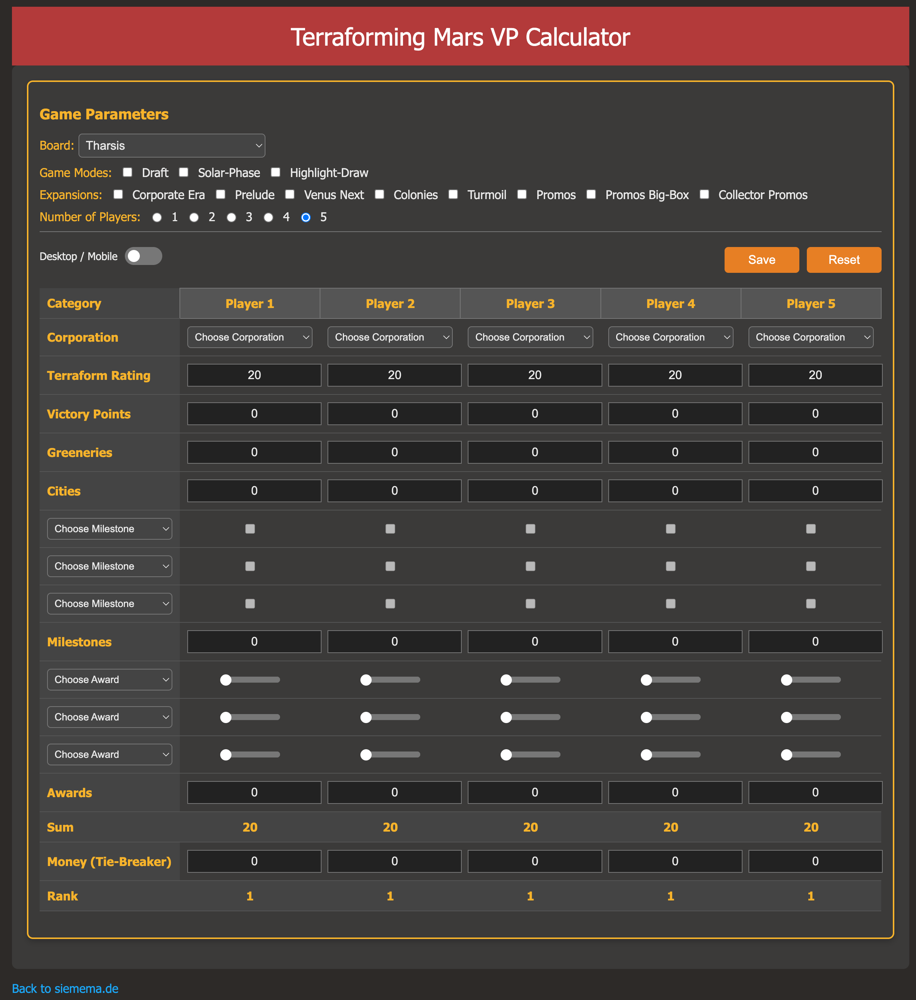

# siemema-tfm
A Terraforming Mars Victory Point Calculator Project

The terraforming Mars VP Calculator is made for calculation victory point as easy and fast as possible during an ongoing game. There are two versions:

## Enriched Version
This is the enriched version with all official boards and the correct awards and milestones for these boards. It has all the corporations available packages in the resective extension packs, which can be chosen in the game parameters section. When chosen a board, the dropdown menus for the awards and milestones will be filled accordingyly. When selected Venus Next, the awards and milestones will be added with the Venus Next awards and milestones. Depending on your chosen extensions, the dropdown menus for the corporations will be prepared. The standard corporations are alwas available. In case of equal victory points, those players with equal VP can enter their money at the end of the game as tie-breaker. The "Reset" button resets all VP and all chosen milestones, awards, corporations, player names and the like. The one thing it does not reset is the board and therefore the dropdowns for awards and milestones are reset to the default of the chosen board.

## Mobile / Easy Version
There is also a mobile version, which is in fact a very early version of this VP calculator. It's version where it all started. It does calculate the points as easy as the other version, but with no data enrichment. The data enriched version is for future projects. 

## Plans for future improvement
I plan to build a backend application which receives the game results and stores them into a database for later data analysis of my games. The "Save" button is just a prototype and still in the works. It basically downloads the result into a JSON file. But as I said, it's still in the works.
